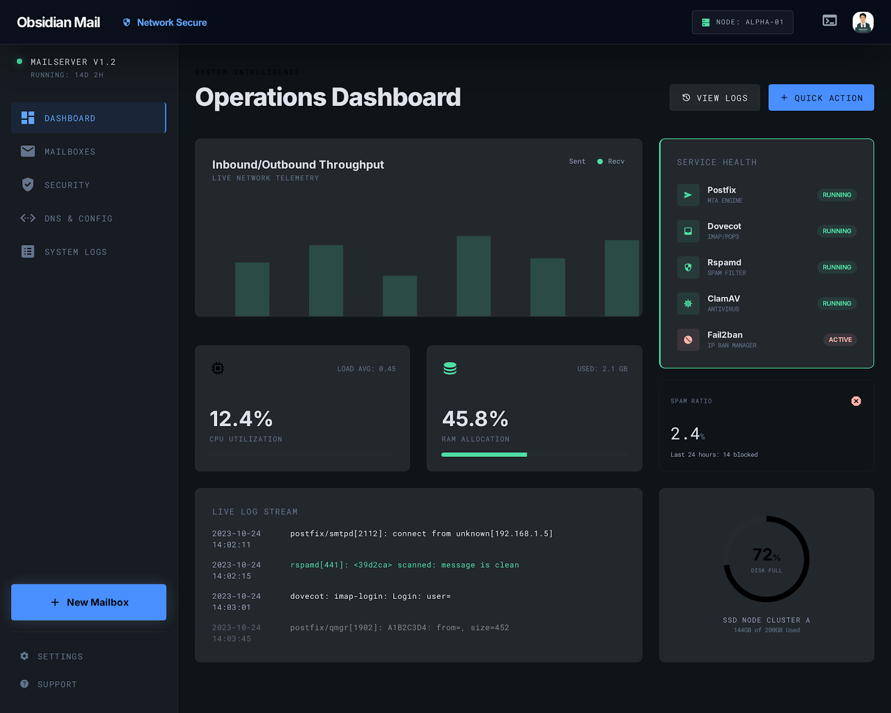
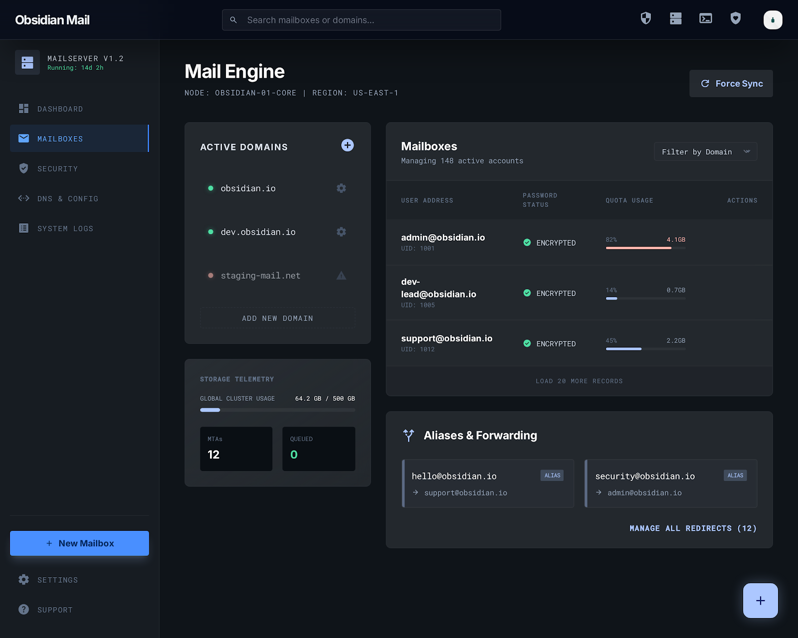
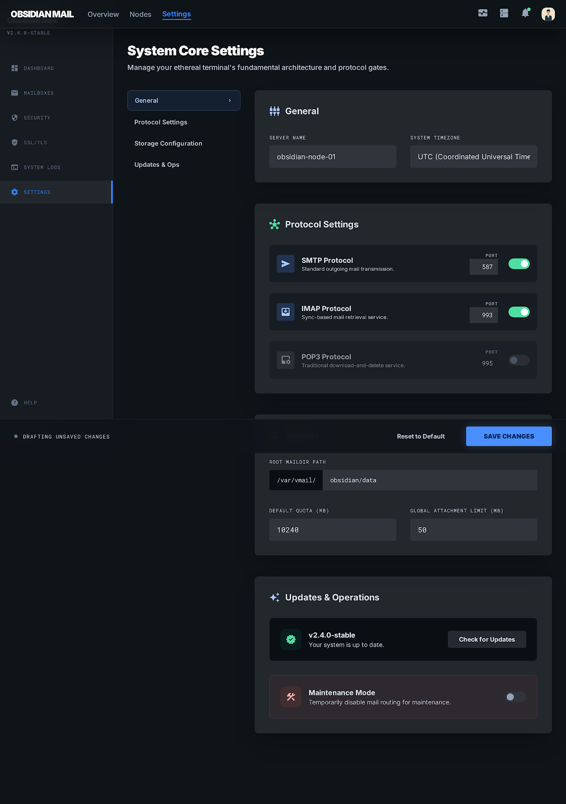
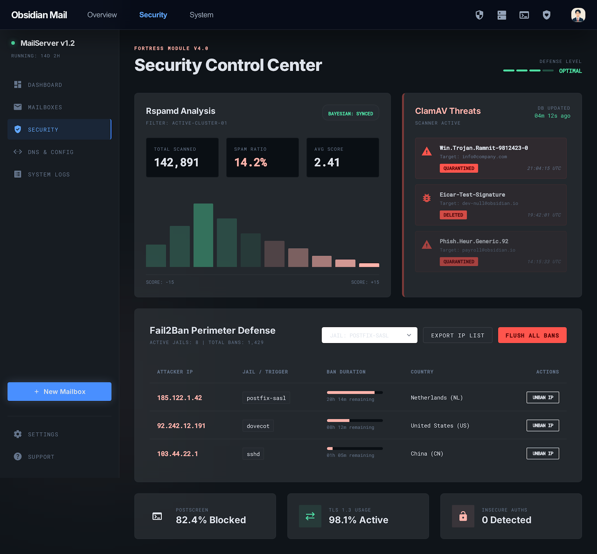
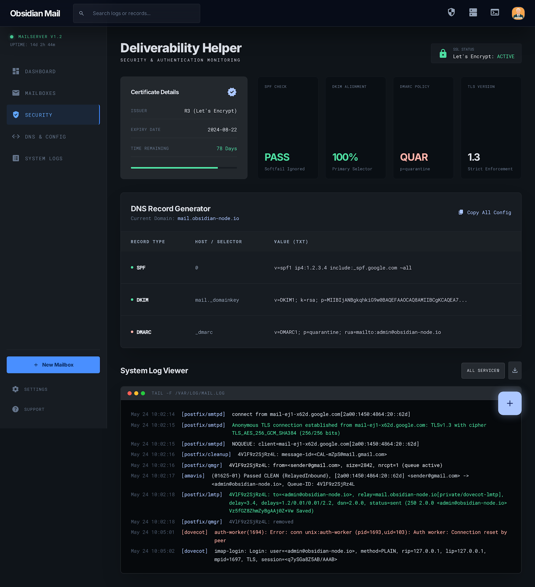

<h1 align="center">
  Obsidian Mail 🌌
</h1>

<p align="center">
  <strong>A modern, web-based management dashboard for a self-hosted Docker mail server stack.</strong>
</p>

<p align="center">
  
  
  
  
</p>

<p align="center">
  Built with the dark "Sentinel Slate" design system, providing a fast, secure, and beautiful interface for administrators.
</p>

---

## ✨ Features

- **Overview Dashboard**: Main health & telemetry metrics.
- **Mail Engine**: Mailbox and Domain management.
- **DNS Logs**: Real-time DNS query log viewer.
- **Fortress Security**: Firewall rules, Fail2Ban, and blocklists panel.
- **Global Settings**: Core mail server configuration.
- **SSL/TLS Certificates**: Auto-renew ACME/Let's Encrypt manager.
- **System Logs Viewer**: Streaming Postfix & Dovecot logs.
- **Command Palette**: Global action overlay for quick navigation.

## 📸 Screenshots

### Overview Dashboard


### Mailboxes & Domains


### Global Settings


### Security Panel


### DNS Logs


## 🔒 Zitadel Authentication Setup

Obsidian Mail relies on [Zitadel](https://zitadel.com/) for secure OIDC (OpenID Connect) authentication and Role-Based Access Control (RBAC). Follow these exact steps to configure your project:

1. **Create an Application:**
   - Go to your Zitadel Project and create a new **Single Page Application (SPA)**.
   - Set the **Redirect URIs** to `http://localhost/callback` (or your production domain).
   - Set the **Post Logout URIs** to `http://localhost/` (or your production domain).
   - *Auth Method:* PKCE (Proof Key for Code Exchange) without Client Secret.
   
2. **Configure Roles:**
   - In your Zitadel Project, go to **Roles** and click **New**.
   - Create a role with the Key: `admin` (or whatever you prefer).
   - Go to **Authorizations** and grant your user the `admin` role for this project.

3. **Enable Role Assertion (CRITICAL):**
   - Go to your Zitadel Project -> **General** or **Settings**.
   - Ensure the box **Assert Roles on Authentication** is checked.
   - *If you skip this step, Zitadel will not include your user's role in the security token, and Obsidian Mail will deny access.*

4. **Define Environment Variables:**
   - Create `obsidian-mail/.env` (from `.env.example`).
   - Copy the `Client ID` from Zitadel and paste it as `OIDC_CLIENT_ID=...`.
   - Update `ZITADEL_ISSUER` with your Zitadel instance URL (e.g., `https://auth2.bitebuddy.it`).
   - Update `REQUIRED_GROUP` to match your Role Key (e.g., `admin`).

---
## ⚙️ Connecting Settings to Docker Mailserver

Obsidian Mail has a built-in Global Settings page that allows you to configure essential `docker-mailserver` environment variables from the web UI.

To make the settings "real" and actually apply them to your mail server, you must share the same environment file between Obsidian Mail and `docker-mailserver`.

1. **In Obsidian Mail's `docker-compose.yml`**:
   The backend container saves changes to a shared docker volume called `mailserver-env` as a file named `mailserver.env`.
   
2. **In your `docker-mailserver`'s `docker-compose.yml`**:
   Map the exact same volume and instruct docker-compose to load the generated `env_file`:

   ```yaml
   services:
     mailserver:
       image: mailserver/docker-mailserver:latest
       # Tell the container to load variables from the GUI file:
       env_file: /path/to/shared/data/mailserver.env
       volumes:
         # Share the volume from Obsidian Mail:
         - obsidian-mail_mailserver-env:/path/to/shared/data
   ```

*(Note: While changes made in the web UI are saved instantly, `docker-mailserver` **requires a manual container restart** to apply new environment variables: `docker compose restart mailserver`)*

---

## 🚀 Quick Start (Local Development)

### 1. Environment Setup

Copy `.env.example` in the `obsidian-mail` directory to `.env` and configure your Zitadel OIDC client credentials:

```bash
cd obsidian-mail
cp .env.example .env
```

### 2. Running with Docker Compose

To start the full stack (Frontend + Backend linked via Docker API):

```bash
docker compose up --build -d
```

- **Frontend** will be available at `http://localhost/` via Nginx.
- **Backend API** will be securely routed behind Nginx under `http://localhost/api/`.

### 3. Local Development (Without Docker for Frontend)
If you want to run the Angular Frontend locally with Hot Module Replacement:
```bash
# Start backend via docker or locally:
cd obsidian-mail/backend
npm install
npm run start:dev

# Start frontend:
cd ../frontend
npm install
npm start
```
The app will be served at `http://localhost:4200`.

## 🛠 Tech Stack

- **Frontend**: Angular 21, Tailwind CSS v4, RxJS, Zitadel OIDC Client.
- **Backend**: NestJS 11, TypeScript, Dockerode (to manage mail server containers), Passport JWT.
- **Infrastructure**: Docker Compose, Nginx.
- **Design System**: "Sentinel Slate" (Dark Mode Glassmorphism with custom Tailwind 4 themes).
